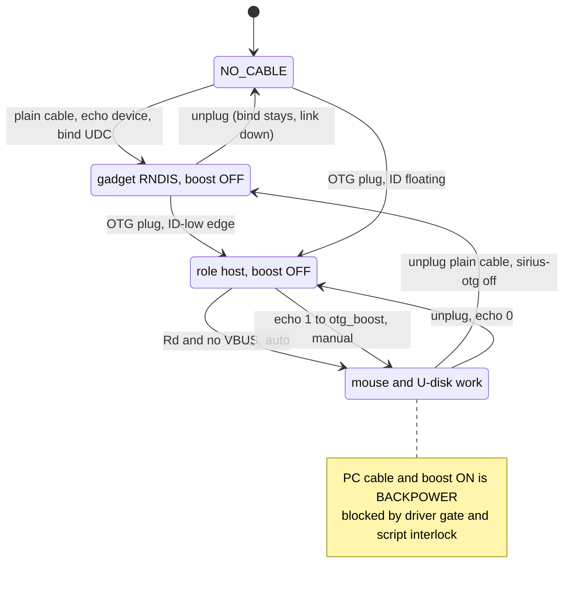

# sirius USB host / 自供电修复手册

> 2026-09-26 定稿，手机实测通过。对应上游 `57UU/linux-sirius`
> `feat/sirius-7.2 @ 3606aa01`，boot 镜像
> `boot_sys-72-otg-20260926.img`（`E:\Tools\Device\8se\linux\boot-images\`）。

## 1. 背景：之前为什么只能当网卡

- `initramfs` 写死 `configfs g1 + rndis.usb0`，`rootfs` 静态 `usb0 172.16.42.1`。
- 更深一层：`usb_1_dwc3` 的 `dr_mode = "peripheral"` 把角色锁死，
  `echo host > /sys/kernel/debug/usb/a600000.usb/mode` 返回成功但读回
  仍是 `device`，dmesg 无任何动静。此时 `extcon` 已报 `USB-HOST=1`，
  说明线缆检测到了，是控制器拒绝切换。
- pmOS 对同类硬件的描述同样适用：`auto` 会来回抖动，只能手动切；
  PMIC 缺供电逻辑，直插无源设备无电；只测 USB2 速率。

## 2. 修复一：解锁角色（已合入主线）

`arch/arm64/boot/dts/qcom/sdm710-xiaomi-sirius.dts`：

```diff
 &usb_1_dwc3 {
-	dr_mode = "peripheral";
+	dr_mode = "otg";
```

补丁已合入上游 `feat/sirius-7.2 @ 3606aa01`（见 `kernel/` submodule）。
当时为避免重编整个内核，用的是 dtb 热补丁流程（server2 有
`dtc/mkbootimg/unpack_bootimg`）：由在用的
`boot_sys-72-nodebug-20260924.img` 解出 `Image.gz + dtb`，
只改 dtb 后原样回编，`Image.gz`/`initramfs`/`cmdline` 保持不变。

改后行为：开机会跟 extcon 走（目前基本是 host，gadget 需手动绑回）；
`mode` 文件读写正常，`UDC` 解绑/重绑正常。

## 3. 修复二：自供电（驱动已转正，见上游 commit）

- 根因：`qcom_smbx`（pm660-charger）把 OTG 配成软件控制后，
  运行时从不真正打开 boost（全文件唯一的 OTG 写操作在 init 表里）。
  下游 smb5 的等效操作是 `smblib_vbus_regulator_enable`：
  `DCDC_CMD_OTG_REG(0x1140) |= BIT(0)`。
- 交付（已转正）：`qcom_smbx` 驱动上游已合入，供电走 `otg_boost` 属性，`sirius-otg` 脚本直接调驱动；`src/sirius-otg-boost/` 测试模块退役（kmod 包里的旧二进制下次刷新时删掉）。
- 验证：`sirius-otg on`（dmesg 显示 `before=0x0 after=0x1`）→ 鼠标灯亮并枚举为
  `USB OPTICAL MOUSE`（`hid-generic`，`REL_X/REL_Y + 左中右键`）；
  `rmmod` → 灯灭掉线。开关系双向验证通过。
- 编译要求模块 vermagic 与手机内核严格一致
  （`7.2.3-sdm670-gcbbdbeb2ca53`，注意 `LOCALVERSION` 环境变量留空
  否则多一个 `+` 后缀导致 `insmod` 拒绝），用 `~/kbuild/linux-sirius`
  按本库 defconfig `modules_prepare` 后编译，见模块目录 README。
- 鼠标可直插使用（PMI660 boost 带得动）；U 盘待测。

## 4. 手动切换命令（WiFi SSH 下执行）

```bash
sudo sirius-otg on      # host + 自供电（OTG 头+外设），并钉住手动
sudo sirius-otg off     # 关供电，回 gadget（RNDIS 用普通线），并钉住手动
sudo sirius-otg auto    # 松开手动，回到事件驱动跟随
sudo sirius-otg status  # 看 follow 模式/角色/供电/usb0

# 以下裸命令仅备用（脚本已包好上面三件事）：
# 切 host（先解绑 gadget）
echo "" | sudo tee /sys/kernel/config/usb_gadget/g1/UDC
echo host | sudo tee /sys/kernel/debug/usb/a600000.usb/mode
echo 1 | sudo tee /sys/bus/platform/devices/c440000.spmi:pmic@0:charger@1000/otg_boost   # 开自供电（驱动属性）

# 切回 gadget（RNDIS）
echo 0 | sudo tee /sys/bus/platform/devices/c440000.spmi:pmic@0:charger@1000/otg_boost   # 先关供电
echo device | sudo tee /sys/kernel/debug/usb/a600000.usb/mode
echo a600000.usb | sudo tee /sys/kernel/config/usb_gadget/g1/UDC
# 注：启动后手动重绑的 gadget，PC 侧需配静态 172.16.42.2/16
#（initramfs 的 udhcpd 只在开机时跑一次）
```

不要往内核 `mode` 文件里写 `auto`（会在 host/device 间来回抖）；`sirius-otg auto` 是用户态跟随开关，两回事。

`on/off` 会在 `/run/sirius-usb-manual` 钉住手动状态，暂停 udev 事件跟随（`/run` 是 tmpfs，重启自动回到 auto）；`auto` 删掉钉子并跑一遍跟随。

## 5. 角色跟随（用户态闭环）

`sirius-usb-bind` 按线缆事件摆角色（事件驱动，无轮询）：PMIC 见 Rd 且充电没在线就切 host（OTG 场景）；ID 接地那路不动，留给手动 `sirius-otg`；其余情况回 device 绑网卡。回 device 前先关 boost（防 backpower），boost 残留（cable 从没置位过、又没外设挂着）顺手扫掉。触发靠 `99-sirius-usb.rules` 三路 udev 事件（pm660-charger power_supply + usb_device 插拔 + qcom_smbx 的 platform/OTG_CABLE 事件）+ 开机跑一次的 `sirius-usb-bind.service`，两个口味构建脚本都已 enable service。

实测 extcon 真实拔插不发 uevent（gpio38 中断没动静），extcon 规则已删，ID 边沿只能走手动；实际干活的是上述三路事件；UDC 绑定是软件状态，拔线不掉绑，只有角色翻转才踢。

## 6. 局限

ID 是 Micro-USB 时代遗留的 OTG 识别针：接地表示当 host，悬空表示 device，只有 0/1 两种状态。CC 是 Type-C 的两根配置线（CC1/CC2），两端靠 Rd/Rp 上下拉协商正反面、角色和供电，是完整协商的输入，安卓走的就是这套。

本机没有 CC 栈：往 mode 里写 auto 会在 host/device 间来回抖，只能手动切；检测也被拆成两块单边信号——gpio38 只看 ID 是否接地，PMIC 只看 CC 上有没有 Rd，各管一面。而廉价头和 A-to-C 线接法混乱（有的两面都接地、有的悬空），翻个面就换了一组信号，这就是部分线要翻面、ID 接地的线钉死 host（RNDIS 必须用普通线）、ID 悬空的头认不出、只有 ID 接地不出 Rd 的那面切了角色还要手动开供电、拔线后还要手动关电的原因。

所以我们用用户态闭环模拟 auto：sirius-usb-bind 靠多路 udev 事件触发（power_supply 看 VBUS 上下线、usb_device 看外设枚举/拔掉，extcon 规则预留等驱动补 uevent），PMIC 见 Rd 且充电没在线就切 host，其余情况回 device 并把 gadget 的 UDC 绑回来（先关 boost 再切角色，读回确认才碰 UDC；未知 VBUS 时保持不动，不强切 host），boost 有残留（cable 从没置位、总线又没外设）就顺手关掉；拿不准就用 sirius-otg on/off 手动指定，auto 永远别往 mode 里写。

## 7. 代办
- CC 完整栈：角色跟随暂由 sirius-usb-bind 事件驱动实现（用户态 udev 多路）；otg_cable 翻转补 uevent/sysfs_notify 已落地并验证（Rd 侧插拔自动跟随）；剩余待办：extcon 边沿 change 事件（gpio38 中断在手机上没动静，ID 线继续走手动），内核级 Type-C 栈以后再说
- 别热替换 charger 驱动：rmmod qcom_smbx 会在注销电源供应时吃 WARN（fg 还拿着引用），并可能在通知链里留坏表项，之后每次电源状态变化都 oops 掉一个 kworker，第二次 rmmod 直接 D 住卸不掉，只能重启；测驱动改动请走重启（新模块已进 lib/modules，重启即生效）。


## 8. 状态机

